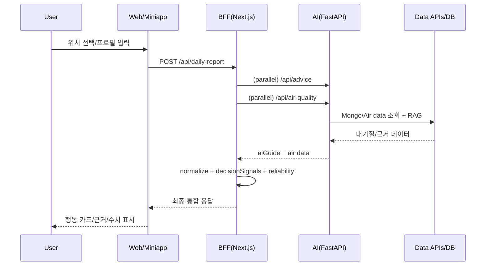
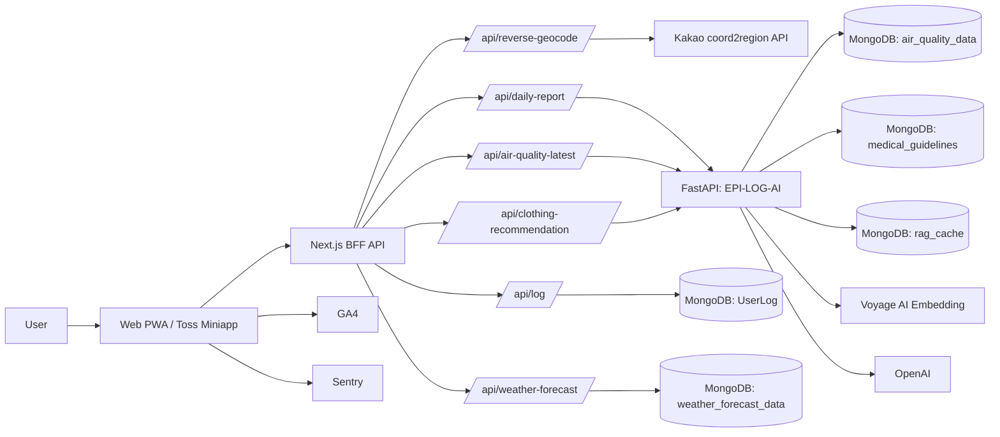
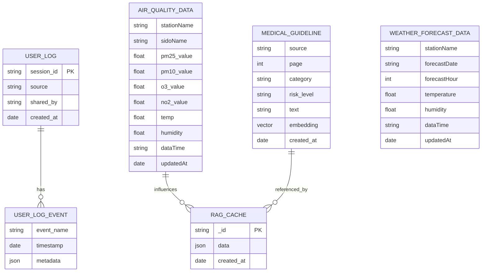

# EPI-LOG 개발 기술 상세 문서 (PPT 연동 확장본)

- 문서 버전: v2.0 (PPT 동기화)
- 작성일: 2026-03-05
- 팀명/프로젝트명: EPI-LOG (아이숨, AI-Soom)
- 서비스 주소: https://ai-soom.site/
- 토스 미니앱: https://minion.toss.im/xbIsO2rl
- GitHub (Main-Web/BFF/Miniapp): https://github.com/CMC-EPI-LOG/EPI-LOG-MAIN
- GitHub (AI-AI API Server): https://github.com/CMC-EPI-LOG/EPI-LOG-AI
- 기반 PPT: 아이숨 개발 발표 자료 17장 버전

---

## 문서 목적
이 문서는 개발 PPT의 모든 내용을 기술 관점으로 확장한 문서다.  
단순 기능 나열이 아니라 다음 4가지를 중심으로 구성한다.

1. 무엇을 만들었는가 (구조/기능)
2. 왜 그렇게 만들었는가 (기획적 제약 + 기술 의사결정)
3. 얼마나 개선했는가 (기대값/실측값/개선폭)
4. 무엇을 배웠는가 (레슨런 + 다음 운영 전략)

---

## PPT-문서 매핑

| PPT 페이지 | PPT 제목 | 본 문서 섹션 |
|---|---|---|
| 1 | Cover | 프로젝트 개요 |
| 2 | Problem & Goal | 1. 프로젝트 기획 개요 |
| 3 | Value | 2. 사용자/운영 가치 정의 |
| 4 | Solution | 3. 솔루션 원칙 |
| 5 | Core Feature | 4. 핵심 기능 구현 |
| 6 | Sequence | 5. 처리 시퀀스 |
| 7 | Architecture | 6. 서비스 아키텍처 |
| 8 | Stack Rational | 7. 기술 선택 의사결정 매트릭스 |
| 9 | BFF Design | 8. BFF 설계 상세 |
| 10 | Decision Engine | 9. 의사결정 엔진 상세 |
| 11 | RAG | 10. RAG 파이프라인 상세 |
| 12 | Data Model | 11. 데이터 모델/ERD |
| 13 | Troubleshooting #1 | 12. 트러블슈팅 Case A |
| 14 | Troubleshooting #2/#3 | 13. 트러블슈팅 Case B/C |
| 15 | Validation & Next | 14. 검증/품질/다음 단계 |
| 16 | BFF API | 15. BFF API 계약 |
| 17 | AI Server API | 16. AI API 계약 |

---

## 1. 프로젝트 기획 개요 (Problem & Goal)

### 1.1 동기
대기질 수치(PM2.5/PM10/O3/NO2/온습도)는 공개되어 있지만, 보호자가 "오늘 아이를 어떻게 행동시켜야 하는가"로 즉시 해석하기는 어렵다.  
특히 연령/기저질환에 따라 동일 수치라도 위험도가 다르므로, 수치 조회 중심 UX는 실제 의사결정을 충분히 지원하지 못한다.

### 1.2 해결하려는 문제
- 대기질 데이터의 복잡성을 행동 지침으로 번역
- 연령/질환별 개인화 가이드 제공
- 외부 API 실패/지연/오염 데이터 유입 상황에서도 안내 연속성 보장

### 1.3 목표
- "오늘 우리 아이가 무엇을 해야 하는지"를 즉시 제시
- 설명 가능한 근거를 함께 제공
- 실패 상황에서도 결과를 끊지 않는 fail-safe 구조 구현

---

## 2. 사용자/운영 가치 정의 (Value)

### 2.1 사용자 가치
- 같은 수치라도 아이 맥락(영아/유아/질환)에 맞는 다른 판단 제공
- 규칙 기반 행동 수칙 + RAG 설명으로 이해 가능성 확보

### 2.2 운영 가치
- Reliability 상태(`LIVE`, `STATION_FALLBACK`, `DEGRADED`) 노출
- 장애/지연 상황에서도 API 응답 shape 유지
- 디버깅 가능한 decision signals 제공

### 2.3 핵심 메시지
- "데이터만 보여주는 서비스"가 아니라 "결정 + 근거"를 동시에 제공
- 단, 결정만 강요하지 않고 상세 근거 접근성을 유지

---

## 3. 솔루션 원칙 (Solution)

### 3.1 제품 원칙
1. 설명 가능한 판단
2. 실패 내성(fallback-first)
3. 운영 가능한 구조(테스트/관측/계약)

### 3.2 구현 원칙
- BFF에서 병렬 호출 + 부분 실패 흡수
- 도메인 규칙은 deterministic하게 강제
- 생성형 설명은 근거 검색 기반으로 제한

---

## 4. 핵심 기능 구현 (Core Feature)

## 4.1 기능 A. 측정소 보정 + 신뢰성 상태

### 입력
- 주소/좌표 또는 사용자 입력 stationName

### 처리
- 주소 문자열에서 측정소 후보군 생성
- 시도(sido) 추론 후 mismatch 필터
- unknown signature 감지 시 다음 후보 재시도

### 출력
- 대기질 데이터 + reliability 메타
  - `LIVE`
  - `STATION_FALLBACK`
  - `DEGRADED`

### 기획적 당위성
- 부모 입장에서 잘못된 지역 데이터는 즉시 신뢰를 훼손함
- 정확도만큼 "왜 이 데이터인지" 설명 가능한 상태 표시가 필요

## 4.2 기능 B. 의사결정 엔진

### 입력
- 대기질: PM2.5, PM10, O3, NO2
- 사용자: ageGroup, condition(s), customConditions
- 기상: temp, humidity

### 핵심 규칙
- RULE-01: O3 고위험 시 `오후 2~5시 외출 금지` 강제
- RULE-02: 영아는 마스크 권고 금지 문구로 치환
- RULE-03: 질환 + 온습도 조건에 따른 위험도 상향

### 출력
- 최종 등급(`GOOD/NORMAL/BAD/VERY_BAD`)
- 행동 수칙(actionItems)
- `decisionSignals` (적용 규칙/보정 근거)

### 기획적 당위성
- 생성형 설명 이전에 안전 규칙이 우선되어야 함
- 예외 상황에서도 일관된 안전 기준 필요

## 4.3 기능 C. RAG 기반 설명 생성

### 입력
- 규칙 엔진 결과 + 대기질/프로필 문맥

### 처리
1. 검색 쿼리 구성
2. 임베딩 생성(Voyage)
3. Vector Search(MongoDB Atlas)
4. OpenAI 설명 생성
5. 캐시 저장/재사용

### 출력
- `three_reason`, `detail_answer`, `references`

### 기획적 당위성
- 단순 명령형 메시지는 신뢰를 떨어뜨릴 수 있어 근거 설명 필요
- 동시에 운영비/지연을 제어하기 위해 캐시가 필수

---

## 5. 처리 시퀀스 (Sequence)

### 5.1 사용자 요청 시퀀스


### 5.2 시퀀스 설계 이유
- 병렬화로 지연 감소
- 부분 실패 시 축소 응답으로 UX 유지
- reliability 상태로 투명성 확보

---

## 6. 서비스 아키텍처 (Architecture)

## 6.1 레포 역할 분리

| 레포 | 역할 |
| --- | --- |
| `EPI-LOG-MAIN` | Web PWA, Toss Miniapp, BFF API, FE 관측/테스트 |
| `EPI-LOG-AI` | 대기질/RAG/규칙/캐시 오케스트레이션 |

## 6.2 전체 구성도



## 6.3 분리 아키텍처 선택 이유
- 장애 격리: AI 장애가 UI 전체 장애로 번지지 않음
- 역할 분리: BFF는 사용자 계약, AI는 생성/검색 책임
- 확장성: Miniapp/Web 클라이언트 확장 시 서버 계약 재사용 가능

---

## 7. 기술 선택 의사결정 매트릭스 (Stack Rational)

> 점수: 1~5, 총점 100 (가중치 반영)

## 7.1 Web/BFF 선택

### 기획적 배경
- 즉시 반응 UX + 실패 흡수 + 빠른 반복 배포가 필요

### 비교군
- A: Next.js App Router + Route Handlers
- B: React(Vite) + Express
- C: NestJS Full-stack

| 평가 기준 | 가중치 | A | B | C |
|---|---:|---:|---:|---:|
| 개발 속도 | 20 | 5 | 4 | 3 |
| BFF 오케스트레이션 적합성 | 20 | 5 | 3 | 4 |
| 배포/운영 단순성 | 15 | 4 | 3 | 3 |
| 팀 생산성 | 15 | 5 | 4 | 3 |
| 생태계/안정성 | 15 | 4 | 4 | 4 |
| UX 전달력(웹앱) | 15 | 5 | 3 | 4 |
| **총점** | **100** | **94** | **70** | **70** |

### 선택
- `Next.js` 채택
- 이유: 구현/운영/UX 안정성의 균형 점수가 가장 높음

## 7.2 AI 서버 선택

### 기획적 배경
- RAG/임베딩/LLM 중심 워크로드
- 비동기 I/O와 AI 라이브러리 접근성 우선

### 비교군
- A: FastAPI
- B: NestJS
- C: Django

| 평가 기준 | 가중치 | A | B | C |
|---|---:|---:|---:|---:|
| AI 생태계 적합성 | 30 | 5 | 3 | 3 |
| 비동기 처리 | 20 | 5 | 4 | 3 |
| 구현 속도 | 15 | 4 | 4 | 3 |
| 배포 단순성 | 10 | 4 | 4 | 3 |
| 팀 생산성 | 15 | 4 | 4 | 3 |
| 확장성 | 10 | 4 | 4 | 3 |
| **총점** | **100** | **90** | **74** | **60** |

### 선택
- `FastAPI` 채택
- 이유: AI 작업 중심 생산성과 비동기 성능 우위

## 7.3 데이터 레이어 선택

### 기획적 배경
- 로그/캐시/벡터/실시간 데이터가 혼합된 형태
- 작은 팀에서 운영 복잡도 최소화 필요

### 비교군
- A: MongoDB 중심 단일 스택
- B: Postgres + pgvector
- C: Postgres + Redis + Vector DB(Polyglot)

| 평가 기준 | 가중치 | A | B | C |
|---|---:|---:|---:|---:|
| 데이터 유연성 | 25 | 5 | 3 | 4 |
| 벡터 통합성 | 20 | 4 | 3 | 5 |
| 운영 복잡도 | 20 | 5 | 3 | 2 |
| 일관성/정합성 | 10 | 2 | 5 | 4 |
| 비용 | 15 | 4 | 4 | 2 |
| 확장성 | 10 | 4 | 4 | 5 |
| **총점** | **100** | **85** | **69** | **72** |

### 선택
- `MongoDB 중심` 채택
- 이유: 초기 제품 단계에서 속도/유연성/운영 단순성 우위

## 7.4 테스트 스택 선택

### 기획적 배경
- 규칙 엔진 회귀 방지 + 사용자 플로우 검증 동시 필요

### 비교군
- A: Vitest + Playwright
- B: Jest + Cypress
- C: 수동 QA 중심

| 평가 기준 | 가중치 | A | B | C |
|---|---:|---:|---:|---:|
| 회귀 탐지력 | 30 | 4 | 4 | 2 |
| 피드백 속도 | 20 | 5 | 3 | 4 |
| E2E 적합성 | 20 | 5 | 4 | 2 |
| CI 적합성 | 15 | 4 | 3 | 5 |
| 운영 비용 | 15 | 4 | 4 | 2 |
| **총점** | **100** | **88** | **73** | **57** |

### 선택
- `Vitest + Playwright` 채택

---

## 8. BFF 설계 상세 (BFF Design)

## 8.1 핵심 책임
- 외부 데이터/AI 병렬 호출
- 응답 normalize 및 안전한 shape 유지
- reliability/decisionSignals 생성
- CORS/에러/재시도 정책 처리

## 8.2 `/api/daily-report` 계약

### Request
```json
{
  "stationName": "강남구",
  "profile": {
    "ageGroup": "elementary_low",
    "condition": "rhinitis",
    "conditions": ["rhinitis"],
    "customConditions": []
  }
}
```

### Response (핵심 필드)
```json
{
  "airQuality": { "grade": "BAD", "pm25_value": 55, "o3_value": 0.07 },
  "aiGuide": { "summary": "...", "actionItems": ["..."], "references": ["..."] },
  "decisionSignals": { "o3OutingBanForced": true, "weatherAdjusted": false },
  "reliability": { "status": "LIVE", "resolvedStation": "강남구" },
  "timestamp": "..."
}
```

## 8.3 설계 포인트
- `Promise.allSettled`로 부분 실패 허용
- Air/AI 결과 불일치 시 재시도 및 보강
- 최종 응답은 프론트 렌더 가능한 최소 shape 보장

---

## 9. 의사결정 엔진 상세 (Decision Engine)

## 9.1 입력/평가
- PM2.5, O3 기반 기본 위험도 계산
- 온습도 + 연령/질환 보정 적용
- PM2.5/O3 동시 고위험 시 상향 규칙 적용

## 9.2 특수 안전 규칙
- O3 고위험: 행동수칙에 `오후 2~5시 외출 금지` 강제
- 영아: 마스크 금지 문구로 치환 + 부적합 활동 문구 제거

## 9.3 출력 신호
- `pm25Grade`, `o3Grade`, `adjustedRiskGrade`, `finalGrade`
- `o3OutingBanForced`, `infantMaskBanApplied`, `weatherAdjusted`

## 9.4 의사코드
```text
baseRisk = max(pm25Grade, o3Grade)
adjustedRisk = applyWeatherAdjustment(baseRisk, profile, temp, humidity)
if pm25>=BAD and o3>=BAD -> final=VERY_BAD
if o3>=BAD -> append("오후 2~5시 외출 금지")
if age==infant -> mask="마스크 착용 금지(영아)" + unsafeActions 제거
```

---

## 10. RAG 파이프라인 상세 (RAG)

## 10.1 단계
1. Query 생성(대기질/프로필 문맥)
2. Voyage 임베딩
3. MongoDB Vector Search
4. OpenAI JSON 생성
5. 캐시 저장/재사용

## 10.2 캐시 전략
- 컬렉션: `rag_cache`
- TTL: 30시간
- 캐시 키 구성: 지역 + 관측시각 + 오염물질 등급/값 + 프로필

## 10.3 장애 내성
- 검색 실패 시 fallback query
- LLM 실패 시 규칙 결과 유지 + 기본 설명 반환

---

## 11. 데이터 모델 및 ERD (Data Model)

## 11.1 핵심 저장소
- `UserLog`
- `air_quality_data`
- `medical_guidelines`
- `rag_cache`
- `weather_forecast_data`

## 11.2 ERD



---

## 12. 트러블슈팅 Case A: 지역 오매칭

## 12.1 문제
`중구`, `강서구` 등 중복 지명에서 타 시도 데이터 매칭 위험 존재.

## 12.2 가설/분석
- stationName 단일 조회는 지역 정합성을 보장하지 못함.
- 주소 문자열에서 시도 정보 누락 시 오매칭 증가.

## 12.3 해결
- `inferExpectedSido` 도입
- `isSidoMismatch` 필터 적용
- `STATION_HINTS` 기반 후보 확장 + 순차 재시도

## 12.4 기대값 vs 실측값 (2026-03-04)

| 지표 | 기대값 | 실측값 | 판정 |
|---|---:|---:|---|
| crossSidoMismatchCount | 0 | 0/33 | 달성 |
| degradedRatio | <= 20% | 0.00% | 달성 |
| 상태 분포 | LIVE 비율 최대화 | LIVE 33/33 | 달성 |

측정 근거:
- `scripts/fixtures/nationwide-stations.sample.json` (17건)
- `scripts/fixtures/busan-major-gu.sample.json` (16건)
- 합계 33건 smoke

## 12.5 레슨런
- "주소"와 "측정소"를 동일 개념으로 처리하면 운영 이슈가 발생한다.
- 정합성 검증 + fallback + 상태 노출은 한 세트로 설계해야 한다.

---

## 13. 트러블슈팅 Case B/C: 지연/품질/Rate Limit

## 13.1 Case B. API 처리 지연

### 문제
- 순차 호출 시 체감 지연 및 tail latency 상승.

### 해결
- BFF 병렬 오케스트레이션(`Promise.allSettled`) 적용.

### 기대값 vs 실측값 (2026-03-04, n=20, station=강남구)

| 지표 | 비교군(순차) | 개선군(BFF 병렬) | 개선율 |
|---|---:|---:|---:|
| Avg latency | 1826ms | 1065ms | 41.7% |
| P50 | 1129ms | 824ms | 27.0% |
| P95 | 9356ms | 3406ms | 63.6% |

### 레슨런
- 평균만 보면 놓치는 tail 문제가 큼.
- 병렬화는 "성공률"보다 "체감성능" 개선에 직접적.

## 13.2 Case C. unknown signature / stale data / RAG rate limit

### 문제
- unknown signature 데이터 유입
- stale 데이터 사용 위험
- 임베딩 rate limit로 인입 실패 가능

### 해결
- unknown signature 감지 후 재시도
- freshness(2시간) 검증
- 3단 폴백(Mongo -> AirKorea -> Mock)
- 임베딩 retry + exponential backoff + batch 제한

### 기대값 vs 실측값

| 지표 | 기대값 | 실측값 | 판정 |
|---|---:|---:|---|
| 핵심 회귀 테스트 통과율 | 100% | 20/20 | 달성 |
| fallback 동작 검증 | 반드시 성공 | clothing fallback test pass | 달성 |
| 시스템 전체 유닛 테스트 | 100% 근접 | 33/35 pass | 미세 보완 필요 |

보완 필요 항목:
- miniapp analytics-ga 테스트 2건 실패(이벤트 전송 mock 경로)

### 레슨런
- 생성형 기능은 "성공 경로"보다 "실패 경로 계약"이 더 중요하다.
- 테스트를 기능 단위와 운영 단위로 분리해 리스크를 관리해야 한다.

---

## 14. 검증 및 품질 보증 (Validation & Next)

## 14.1 검증 전략
- Unit: 규칙/보정/fallback 로직
- E2E: 위치 -> 프로필 -> 결과 렌더링
- CSV Contract: 80 시나리오 정합성

## 14.2 정량 지표
- CSV fixture: 80행, grade-age-condition 조합 80개 유니크
- 핵심 회귀 테스트: 20/20 pass
- 신뢰성 스모크: 33건 중 mismatch 0, degraded 0

## 14.3 다음 단계
- analytics-ga 테스트 2건 안정화
- AirKorea direct 연동 완전 전환
- SLO 기반 모니터링/알림 룰 정교화

---

## 15. BFF API 계약 상세 (Slide 16 확장)

| Method | Endpoint | 책임 |
| --- | --- | --- |
| POST | `/api/daily-report` | 통합 리포트 생성(병렬 호출+정규화+신뢰성 메타) |
| GET | `/api/air-quality-latest` | 실시간 대기질 갱신 |
| POST | `/api/reverse-geocode` | 좌표 -> 행정구역/측정소 후보 |
| POST | `/api/clothing-recommendation` | 옷차림 추천(우선 AI, 실패 시 fallback) |
| GET | `/api/weather-forecast` | 48시간 예보 |
| POST | `/api/log` | 세션 이벤트 저장 |

API 배려 포인트:
- FE는 `reliability`, `decisionSignals` 필드로 안전하게 분기 가능
- BE는 실패 시에도 response shape를 유지해 UI 회귀를 줄임

---

## 16. AI API 계약 상세 (Slide 17 확장)

| Method | Endpoint | 책임 |
| --- | --- | --- |
| POST | `/api/advice` | 규칙+RAG 행동 가이드 생성 |
| GET | `/api/air-quality` | 대기질 조회 + 폴백 체인 |
| POST | `/api/clothing-recommendation` | 규칙/AI 옷차림 추천 |
| POST | `/api/ingest/pdf` | PDF 임베딩 인입 |
| GET | `/api/openai/v1/health` | OpenAI Proxy 상태 확인 |
| POST | `/api/openai/v1/responses` | OpenAI Responses Proxy |

AI 서버 계약 원칙:
- 생성형 응답이 실패해도 규칙 기반 핵심 결과는 반환
- 캐시와 폴백을 통해 응답 연속성 유지

---

## 17. 운영/배포/관측

## 17.1 배포
- Web/BFF: Vercel
- AI: Vercel(FastAPI 엔트리)
- Miniapp: granite build + ait deploy

## 17.2 관측
- Sentry: 에러/컨텍스트 태그
- GA4: 이벤트 계측
- 로그: reliability 경로 및 캐시 동작 분석

## 17.3 핵심 환경 변수
- Web/BFF: `NEXT_PUBLIC_DATA_API_URL`, `NEXT_PUBLIC_AI_API_URL`, `KAKAO_REST_API_KEY`, `MONGODB_URI` 등
- AI: `MONGODB_URI`, `VOYAGE_API_KEY`, `OPENAI_API_KEY`, `OPENAI_PROXY_TOKEN` 등

---

## 18. 성과 및 회고

## 18.1 성과
- 규칙 기반 안전성 + RAG 설명 결합
- 실패 내성(fallback-first) 아키텍처 구축
- 계약/검증 중심 개발 문화 정착

## 18.2 한계
- 외부 데이터 편차에 의존
- 일부 분석 계측 테스트 안정화 필요

## 18.3 액션 아이템
1. analytics-ga 테스트 2건 수정 및 CI 고정
2. reliability smoke를 nightly 자동 실행으로 전환
3. API 성능 SLO(Avg/P95) 수립 및 모니터링

---

## 19. 부록

## 19.1 제출 링크
- 서비스 주소: https://ai-soom.site/
- 토스 미니앱: https://minion.toss.im/xbIsO2rl
- GitHub Main: https://github.com/CMC-EPI-LOG/EPI-LOG-MAIN
- GitHub AI: https://github.com/CMC-EPI-LOG/EPI-LOG-AI
- 발표 영상: [추가 예정]
- PR PPT: [추가 예정]

## 19.2 측정 명령 (재현용)

```bash
# Reliability smoke (전국/부산)
node scripts/nationwide-reliability-smoke.mjs \
  --base-url https://www.ai-soom.site \
  --fixture scripts/fixtures/nationwide-stations.sample.json

node scripts/nationwide-reliability-smoke.mjs \
  --base-url https://www.ai-soom.site \
  --fixture scripts/fixtures/busan-major-gu.sample.json

# 핵심 유닛 테스트
npx vitest run \
  tests/unit/daily-report.route.test.ts \
  tests/unit/stationResolution.test.ts \
  tests/unit/clothing-recommendation.route.test.ts
```
