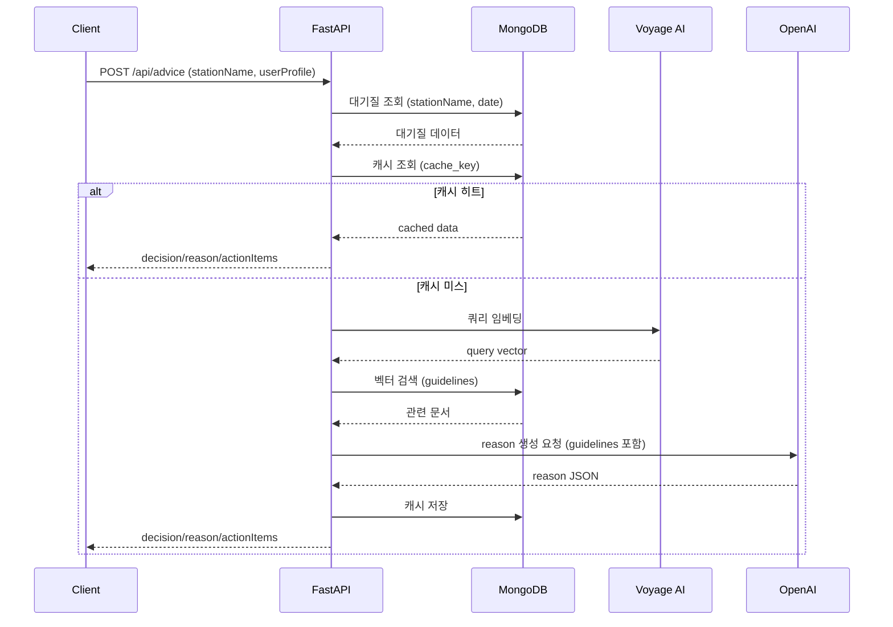
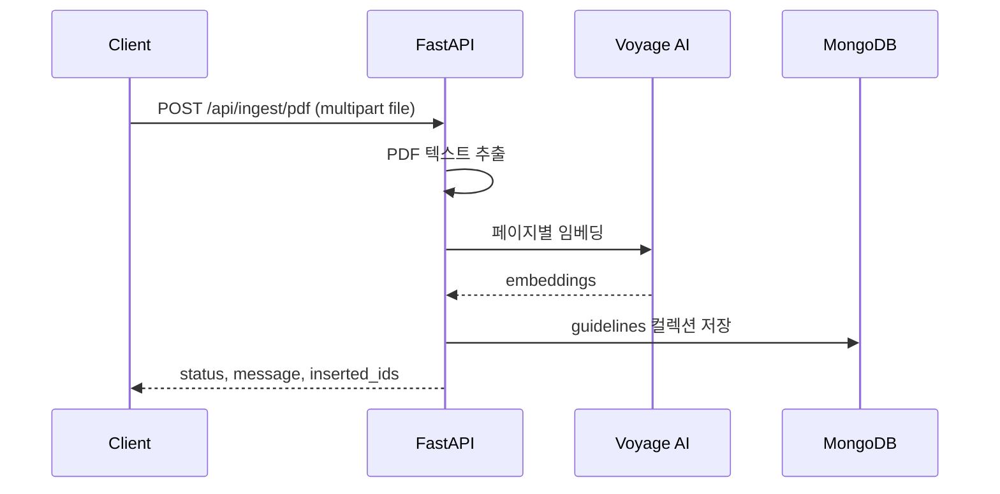

# EPI-LOG AI

## 프로젝트 개요

EPI-LOG AI는 대기질(미세먼지/오존 등)과 사용자 프로필을 기반으로 맞춤형 건강 행동 가이드를 제공하는 RAG 기반 API 서버입니다. 의료 가이드라인을 벡터 검색으로 불러오고, LLM을 통해 근거(reason)를 생성합니다.

## 시스템 아키텍처

- **클라이언트**: 웹/모바일/서비스가 API 호출
- **API 서버 (FastAPI)**: 요청 검증, 서비스 오케스트레이션, 응답 반환
- **DB (MongoDB)**: 가이드라인, 대기질 데이터, 캐시 저장
- **벡터 검색 (MongoDB Atlas Vector Search)**: 가이드라인 유사도 검색
- **임베딩 (Voyage AI)**: 문서/쿼리 임베딩 생성
- **LLM (OpenAI)**: 의학적 근거(reason) 생성
- **배치 스크립트**: 가이드라인/문서 임베딩 및 적재
- **배포 (Vercel)**: 서버리스 배포

## 기술 스택

- **Backend**: FastAPI, Uvicorn
- **DB/Vector**: MongoDB, Motor (async), MongoDB Atlas Vector Search
- **LLM/Embedding**: OpenAI, Voyage AI
- **문서 처리**: PyPDF2
- **환경 관리**: python-dotenv
- **배포**: Vercel (`vercel.json`)

## System Flow (Sequence Diagram)

### 1) 의료 조언 생성 (RAG)



### 2) PDF 인입



## Architecture Overview

- **핵심 모듈**: `main.py` (라우팅) → `app/services.py` (비즈니스 로직)
- **데이터 저장소**:
  - `medical_guidelines`: 임베딩 포함 가이드라인/문서
  - `daily_air_quality`: 날짜별 대기질 데이터
  - `rag_cache`: 사용자/대기질 기반 캐시
- **결정 로직**: PM2.5, O3 등급 기반으로 `ok/caution/warning` 산출
- **응답 구성**: 결정 텍스트 + 행동 지침(템플릿) + LLM reason
- **폴백 로직**: 캐시 실패, 벡터 검색 실패, LLM 실패에 대한 안전 장치 포함

## 상세 기능 요구사항 (Functional Requirements)

### A. 의료 조언 (RAG)

- 사용자는 `stationName`과 `userProfile(ageGroup, condition)`을 전달한다.
- 시스템은 당일 대기질을 조회한다.
- 대기질 데이터가 없을 경우 개발용 모의 데이터로 대체한다.
- 대기질과 사용자 프로필을 기반으로 캐시 키를 생성하고 결과 캐시를 조회한다.
- 캐시가 없으면, 검색 쿼리를 구성하고 벡터 검색을 수행한다.
- 검색 결과(가이드라인)를 바탕으로 LLM에 reason 생성을 요청한다.
- 결정 텍스트 및 행동 지침은 시스템 규칙 기반으로 산출한다.
- 최종 결과는 캐시에 저장한다.

### B. 문서/PDF 인입

- PDF 파일을 업로드 받아 페이지별 텍스트를 추출한다.
- 최소 길이 기준을 만족하는 페이지에 대해서만 임베딩을 생성한다.
- 임베딩과 메타데이터를 `medical_guidelines` 컬렉션에 저장한다.
- 성공 시 삽입된 문서 ID 목록을 반환한다.

### C. 데이터 적재 (배치)

- `scripts/ingest_data.py`: `data/guidelines.json`을 임베딩 후 DB에 적재한다.
- `scripts/ingest_pdfs.py`: `upload/` 폴더의 PDF들을 배치로 임베딩 후 적재한다.
- Voyage AI의 Rate Limit을 고려한 재시도/지연 로직을 포함한다.

### D. 운영/배포

- Vercel 서버리스 환경에서 `main.py`를 엔트리로 실행한다.
- 환경 변수는 `.env` 혹은 Vercel Project Settings에 설정한다.

## API 명세 (Backend Endpoints)

### Base URL

- Local: `http://localhost:8000`
- Production: `https://<your-project-name>.vercel.app`

### 1) Health Check

- **GET** `/`
- **Response**
  - `status`: String (`"ok"`)
  - `service`: String (`"Epilogue API"`)

### 2) Get Medical Advice (RAG)

- **POST** `/api/advice`
- **Content-Type**: `application/json`
- **Request Body**
  - `stationName` (String): 대기질 측정소명
  - `userProfile` (Object)
    - `ageGroup`: `"infant" | "elementary_low" | "elementary_high" | "teen"`
    - `condition`: `"asthma" | "rhinitis" | "none" | "etc"`
- **Response**
  - `decision`: String (결정 문구)
  - `reason`: String (LLM 생성 근거)
  - `actionItems`: String[] (행동 지침)
  - `references`: String[] (가이드라인 출처)
- **Error**
  - `500`: 내부 오류 (결정/근거 생성 실패)

### 3) Ingest PDF (Single File)

- **POST** `/api/ingest/pdf`
- **Content-Type**: `multipart/form-data`
- **Request Form**
  - `file`: PDF 파일
- **Response**
  - `status`: `"success" | "error"`
  - `message`: String
  - `inserted_ids`: String[] (성공 시)
- **Error**
  - `400`: PDF가 아닌 파일 업로드
  - `500`: 처리 실패

### 4) OpenAI Responses Proxy (Server-to-Server)

- **GET** `/api/openai/v1/health`
- **Response**
  - `ok`: Boolean
  - `service`: `"openai-proxy"`
  - `upstream_base_url`: String
  - `proxy_token_required`: Boolean
  - `openai_key_configured`: Boolean

- **POST** `/api/openai/v1/responses`
- **Content-Type**: `application/json`
- **Header**
  - `x-proxy-token`: String (required when `OPENAI_PROXY_TOKEN` is set)
- **Body**
  - OpenAI Responses API payload 그대로 전달
- **Response**
  - OpenAI `/v1/responses`의 status/body를 그대로 반환

예시:
```bash
curl -X POST "https://<your-domain>/api/openai/v1/responses" \
  -H "Content-Type: application/json" \
  -H "x-proxy-token: <OPENAI_PROXY_TOKEN>" \
  -d '{
    "model": "gpt-5-nano",
    "input": [{"role":"user","content":[{"type":"input_text","text":"test"}]}]
  }'
```

## 환경 변수

- `MONGODB_URI` (or `MONGO_URI`)
- `VOYAGE_API_KEY`
- `OPENAI_API_KEY`
- `OPENAI_PROXY_TOKEN` (권장, 프록시 보호용)
- `OPENAI_UPSTREAM_BASE_URL` (기본: `https://api.openai.com/v1`)
- `OPENAI_PROXY_TIMEOUT_SECONDS` (기본: `180`)

## 실행 방법

```bash
pip install -r requirements.txt
uvicorn main:app --reload
```
# Updated: Thu Feb  5 22:11:20 KST 2026
