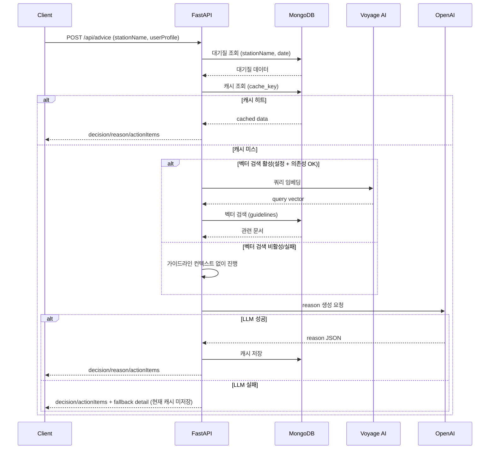
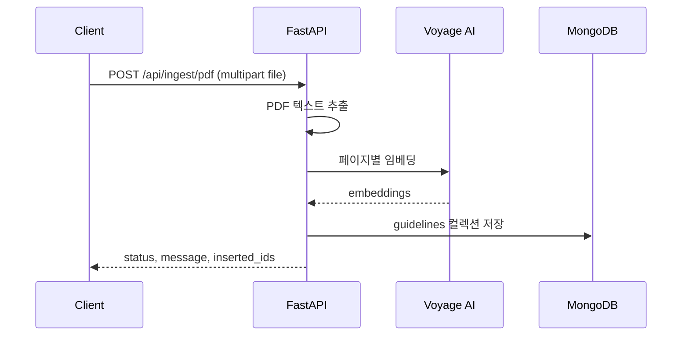

# EPI-LOG AI

## 프로젝트 개요

EPI-LOG AI는 대기질(미세먼지/오존 등)과 사용자 프로필을 기반으로 맞춤형 건강 행동 가이드를 제공하는 API 서버입니다. 핵심 결정/행동지침은 규칙 기반으로 생성하고, 벡터 검색 + LLM은 설정/의존성 상태에 따라 선택적으로 근거 문장을 보강합니다.

## 시스템 아키텍처

- **클라이언트**: 웹/모바일/서비스가 API 호출
- **API 서버 (FastAPI)**: 요청 검증, 서비스 오케스트레이션, 응답 반환
- **DB (MongoDB)**: 가이드라인, 대기질 데이터, 캐시 저장
- **벡터 검색 (MongoDB Atlas Vector Search)**: 가이드라인 유사도 검색
- **임베딩 (Voyage AI)**: 문서/쿼리 임베딩 생성
- **LLM (OpenAI)**: 의학적 근거(reason) 생성
- **배치 스크립트**: 가이드라인/문서 임베딩 및 적재
- **배포 (Vercel)**: 서버리스 배포

## 기술 스택

- **Backend**: FastAPI, Uvicorn
- **DB/Vector**: MongoDB, Motor (async), MongoDB Atlas Vector Search
- **LLM/Embedding**: OpenAI, Voyage AI
- **문서 처리**: PyPDF2
- **환경 관리**: python-dotenv
- **배포**: Vercel (`vercel.json`)

## System Flow (Sequence Diagram)

### 1) 의료 조언 생성 (RAG)


```mermaid
sequenceDiagram
  participant Client
  participant API as FastAPI
  participant DB as MongoDB
  participant VO as Voyage AI
  participant LLM as OpenAI

  Client->>API: POST /api/advice (stationName, userProfile)
  API->>DB: 대기질 조회 (stationName, date)
  DB-->>API: 대기질 데이터
  API->>DB: 캐시 조회 (cache_key)
  alt 캐시 히트
    DB-->>API: cached data
    API-->>Client: decision/reason/actionItems
  else 캐시 미스
    alt 벡터 검색 활성(설정 + 의존성 OK)
      API->>VO: 쿼리 임베딩
      VO-->>API: query vector
      API->>DB: 벡터 검색 (guidelines)
      DB-->>API: 관련 문서
    else 벡터 검색 비활성/실패
      API->>API: 가이드라인 컨텍스트 없이 진행
    end
    API->>LLM: reason 생성 요청
    alt LLM 성공
      LLM-->>API: reason JSON
      API->>DB: 캐시 저장
      API-->>Client: decision/reason/actionItems
    else LLM 실패
      API-->>Client: decision/actionItems + fallback detail (현재 캐시 미저장)
    end
  end
```

### 2) PDF 인입


```mermaid
sequenceDiagram
  participant Client
  participant API as FastAPI
  participant VO as Voyage AI
  participant DB as MongoDB

  Client->>API: POST /api/ingest/pdf (multipart file)
  API->>API: PDF 텍스트 추출
  API->>VO: 페이지별 임베딩
  VO-->>API: embeddings
  API->>DB: guidelines 컬렉션 저장
  API-->>Client: status, message, inserted_ids
```

## Architecture Overview

- **핵심 모듈**: `main.py` (라우팅) → `app/services.py` (비즈니스 로직)
- **데이터 저장소**:
  - `medical_guidelines`: 임베딩 포함 가이드라인/문서
  - `air_quality_data`: 실시간/주기 적재 대기질 데이터(우선 조회)
  - `daily_air_quality`: 레거시/보조 컬렉션
  - `rag_cache`: 사용자/대기질 기반 캐시
- **결정 로직**: PM2.5/PM10/O3 및 보정 로직을 반영한 4단계(`좋음/보통/나쁨/매우나쁨`) 등급으로 CSV 80행 매트릭스 매핑
- **응답 구성**: 결정 텍스트 + 행동 지침(규칙 기반) + 상세 설명(LLM 성공 시 생성, 실패 시 결정형 대체 설명 생성)
- **폴백 로직**: 대기질(MongoDB → AirKorea → Mock), 벡터 검색 비활성/실패, LLM 실패 시에도 계약 필드(`reason/detail_answer/three_reason`)를 의미 있는 문장으로 유지

## 상세 기능 요구사항 (Functional Requirements)

### A. 의료 조언 (RAG)

- 사용자는 `stationName`과 `userProfile(ageGroup, condition)`을 전달한다.
- 시스템은 당일 대기질을 조회한다.
- 대기질 데이터가 없을 경우 개발용 모의 데이터로 대체한다.
- 대기질과 사용자 프로필을 기반으로 캐시 키를 생성하고 결과 캐시를 조회한다.
- 캐시가 없으면, 검색 쿼리를 구성하고 (설정 시) 벡터 검색을 수행한다.
- 벡터 검색은 `ADVICE_VECTOR_SEARCH_ENABLED=1` 이고 Voyage/DB 사용 가능할 때만 동작한다.
- LLM에 상세 설명 생성을 요청하고, 실패 시에도 규칙 기반 결정/행동지침과 실측값으로 결정형 설명을 합성해 반환한다.
- 결정 텍스트 및 행동 지침은 시스템 규칙 기반으로 산출한다.
- 최종 결과 캐시는 현재 구현상 LLM 성공 경로에서 저장된다.

### B. 문서/PDF 인입

- PDF 파일을 업로드 받아 페이지별 텍스트를 추출한다.
- 최소 길이 기준을 만족하는 페이지에 대해서만 임베딩을 생성한다.
- 임베딩과 메타데이터를 `medical_guidelines` 컬렉션에 저장한다.
- 성공 시 삽입된 문서 ID 목록을 반환한다.

### C. 데이터 적재 (배치)

- `scripts/ingest_data.py`: `data/guidelines.json`을 임베딩 후 DB에 적재한다.
- `scripts/ingest_pdfs.py`: `upload/` 폴더의 PDF들을 배치로 임베딩 후 적재한다.
- Voyage AI의 Rate Limit을 고려한 재시도/지연 로직을 포함한다.
- `data/guidelines.json`은 레포 기본 포함 파일이 아니므로 별도 준비가 필요하다.

### D. 운영/배포

- Vercel 서버리스 환경에서 `main.py`를 엔트리로 실행한다.
- 환경 변수는 `.env` 혹은 Vercel Project Settings에 설정한다.

## API 명세 (Backend Endpoints)

### Base URL

- Local: `http://localhost:8000`
- Production: `https://<your-project-name>.vercel.app`

### 1) Health Check

- **GET** `/`
- **Response**
  - `status`: String (`"ok"`)
  - `service`: String (`"Epilogue API"`)

### 2) Get Medical Advice (RAG)

- **POST** `/api/advice`
- **Content-Type**: `application/json`
- **Request Body**
  - `stationName` (String): 대기질 측정소명
  - `userProfile` (Object)
    - `ageGroup`: `"infant" | "toddler" | "elementary_low" | "elementary_high" | "teen_adult"`
    - `condition`: `"general" | "rhinitis" | "asthma" | "atopy"`
- **Response**
  - `decision`: String (결정 문구)
  - `csv_reason`: String | null (CSV `이유` 컬럼)
  - `reason`: String | null (`detail_answer`와 동일한 호환 필드)
  - `three_reason`: String[] (3개 요약 문장)
  - `detail_answer`: String (상세 설명)
  - `actionItems`: String[] (행동 지침)
  - `references`: String[] (가이드라인 출처)
  - `pm25_value`, `pm10_value`, `o3_value`, `no2_value`: Number (실행 시점에 포함될 수 있음)
- **Error**
  - `500`: 내부 오류 (결정/근거 생성 실패)

CSV 컬럼 반환 규칙:
- `메인문구` -> `decision`
- `이유` -> `csv_reason`
- `행동1~3` -> `actionItems`
- `대기등급`, `연령대`, `질환군`은 응답에 직접 반환하지 않음

### 3) Get Air Quality

- **GET** `/api/air-quality`
- **Query Parameters**
  - `stationName` (String, required): 측정소/지역명
- **Response**
  - `stationName`: String
  - `sidoName`: String | null
  - `pm25_value`, `pm10_value`, `o3_value`, `no2_value`, `co_value`, `so2_value`: Number
  - `pm25_grade`, `pm10_grade`, `o3_grade`, `no2_grade`, `co_grade`, `so2_grade`: String (`좋음/보통/나쁨/매우나쁨`)
  - `temp`: Number
  - `humidity`: Number
  - `dataTime`: String | null
- **Status**
  - `200`: 정상 반환
  - `404`: 해당 측정소 데이터 없음 (현재 구현에서는 최종 Mock fallback이 있어 일반적으로 `200` 반환)
  - `500`: 내부 오류
- **동작 우선순위**
  1. MongoDB `air_quality_data`
  2. Air Korea fallback API
  3. Mock data fallback

예시:
```bash
curl -G "https://<your-domain>/api/air-quality" \
  --data-urlencode "stationName=종로구"
```

### 4) Clothing Recommendation (Rule + AI Hybrid)

- **POST** `/api/clothing-recommendation`
- **Content-Type**: `application/json`
- **Request Body**
  - `temperature` (Number, optional, default `22.0`)
  - `humidity` (Number, optional, default `45.0`)
  - `userProfile` (Object, optional)
    - `ageGroup`: `"infant" | "toddler" | "elementary_low" | "elementary_high" | "teen_adult"`
    - `condition`: `"general" | "rhinitis" | "asthma" | "atopy"`
  - `airQuality` (Object, optional)
    - `grade`, `pm25Grade`, `pm10Grade`, `o3Grade`
  - `airGrade` (String, optional): `airQuality.grade` 별칭 입력
- **Response**
  - `summary`: String
  - `recommendation`: String
  - `tips`: String[]
  - `comfortLevel`: `"FREEZING" | "COLD" | "CHILLY" | "MILD" | "WARM" | "HOT"`
  - `temperature`: Number
  - `humidity`: Number
  - `source`: String
    - `rule-based-v1`
    - `ai-dynamic-v1`
    - `rule-based-fallback-no-openai`
    - `rule-based-fallback-on-error`
    - `fallback` (엔드포인트 레벨 예외 시)
- **동작 규칙**
  - 기본은 규칙 기반(`rule-based-v1`) 추천을 반환
  - `userProfile` + `airQuality(또는 airGrade)`가 함께 들어오고 OpenAI 호출 성공 시 AI 개인화(`ai-dynamic-v1`)로 전환
  - OpenAI 미구성/호출 실패 시 규칙 기반 폴백 source로 반환

예시:
```bash
curl -X POST "https://<your-domain>/api/clothing-recommendation" \
  -H "Content-Type: application/json" \
  -d '{
    "temperature": 27.3,
    "humidity": 68
  }'
```

### 5) Ingest PDF (Single File)

- **POST** `/api/ingest/pdf`
- **Content-Type**: `multipart/form-data`
- **Request Form**
  - `file`: PDF 파일
- **Response**
  - `status`: `"success" | "error"`
  - `message`: String
  - `inserted_ids`: String[] (성공 시)
- **Error**
  - `400`: PDF가 아닌 파일 업로드
  - `500`: 라우트 레벨 예외
  - `200` + `status=error`: 인입 처리 로직 실패(예: Voyage/DB 초기화 실패, 텍스트 추출 실패)

### 6) OpenAI Responses Proxy (Server-to-Server)

- **GET** `/api/openai/v1/health`
- **Response**
  - `ok`: Boolean
  - `service`: `"openai-proxy"`
  - `upstream_base_url`: String
  - `proxy_token_required`: Boolean
  - `openai_key_configured`: Boolean

- **POST** `/api/openai/v1/responses`
- **Content-Type**: `application/json`
- **Header**
  - `x-proxy-token`: String (required when `OPENAI_PROXY_TOKEN` is set)
- **Body**
  - OpenAI Responses API payload 그대로 전달
- **Response**
  - OpenAI `/v1/responses`의 status/body를 그대로 반환

예시:
```bash
curl -X POST "https://<your-domain>/api/openai/v1/responses" \
  -H "Content-Type: application/json" \
  -H "x-proxy-token: <OPENAI_PROXY_TOKEN>" \
  -d '{
    "model": "gpt-5-nano",
    "input": [{"role":"user","content":[{"type":"input_text","text":"test"}]}]
  }'
```

## 환경 변수

- `MONGODB_URI` (or `MONGO_URI`)
- `MONGO_DB_NAME` (기본: `epilog_db`)
- `AIR_QUALITY_DB_NAME` (미설정 시 URI에서 추론 또는 `MONGO_DB_NAME` 사용)
- `VOYAGE_API_KEY`
- `OPENAI_API_KEY`
- `OPENAI_MAX_RETRIES` (기본: `0`)
- `ADVICE_LLM_MODEL` (기본: `gpt-4.1-nano`)
- `CLOTHING_LLM_MODEL` (기본: `gpt-4.1-nano`, 미설정 시 `ADVICE_LLM_MODEL` 사용)
- `ADVICE_VECTOR_SEARCH_ENABLED` (기본: `0`, `1`로 설정 시 Voyage 벡터 검색 활성화)
- `ADVICE_LLM_TIMEOUT_MS` (기본: `4500`)
- `ADVICE_*_TIMEOUT_MS` 계열은 코드에서 상/하한 클램프가 적용됩니다.
  - `ADVICE_AIR_FETCH_TIMEOUT_MS`: 300~5000
  - `ADVICE_CACHE_READ_TIMEOUT_MS`: 150~1800
  - `ADVICE_VECTOR_EMBED_TIMEOUT_MS`: 250~2500
  - `ADVICE_VECTOR_QUERY_TIMEOUT_MS`: 200~2200
  - `ADVICE_LLM_TIMEOUT_MS`: 600~12000
  - `ADVICE_CACHE_WRITE_TIMEOUT_MS`: 150~1800
- `OPENAI_PROXY_TOKEN` (권장, 프록시 보호용)
- `OPENAI_UPSTREAM_BASE_URL` (기본: `https://api.openai.com/v1`)
- `OPENAI_PROXY_TIMEOUT_SECONDS` (기본: `300`)

## 실행 방법

```bash
pip install -r requirements.txt
uvicorn main:app --reload
```
# Updated: Fri Mar  6 14:40:00 KST 2026
